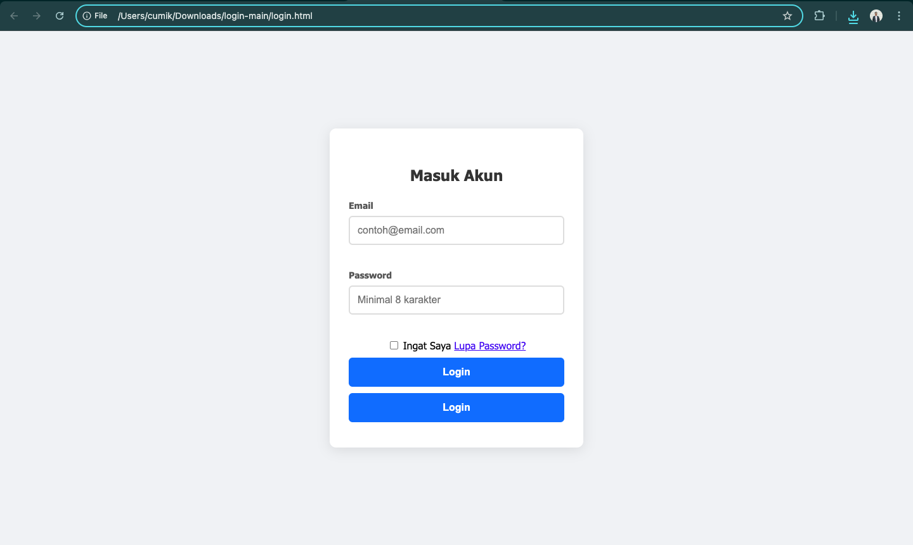

# Simple Login Form

A basic frontend project to create a clean and modern login page. This project is built using only HTML and CSS, designed as an accessible starting point for further development.

## 🎨 Appearance

This page features a login form centered on the screen against a light gray background. The form itself utilizes a white background, rounded corners, and soft drop shadows to create a modern aesthetic.



## ✨ Features

-   **Username Input**: Field for entering the username.
-   **Password Input**: Field for entering the password (characters are masked).
-   **Login Button**: Interactive button with a `hover` effect.
-   **Basic Validation**: Uses HTML5 `required` attributes to ensure no fields are left empty.
-   **Minimalist Design**: A clean, centered layout created entirely with internal CSS.

## 🛠️ Technologies Used

This project purely utilizes basic web frontend technologies:

-   **HTML5**: For the form structure and content.
-   **CSS3**: For styling, layout, and visual appearance.

No external frameworks or libraries are used.

## 🚀 How to Run

There is no complex installation process. Simply follow these steps:

1.  **Clone or Download the Project**
    If this is a Git repository, you can clone it:
    ```bash
    git clone [https://github.com/jerico-c/login/](https://github.com/jerico-c/login/)
    ```
    Alternatively, simply download the `login.html` file.

2.  **Open the File in a Browser**
    Open the `login.html` file directly in your favorite web browser (such as Google Chrome, Mozilla Firefox, or Microsoft Edge).

## 📁 File Structure

The project structure is very simple, consisting of the following files:
